# Housing Market Analysis

</img>
*Image Credit: [San Francisco Park Reading by Juan Salamanca](https://www.pexels.com/photo/park-san-francisco-reading-61109/) | [Free License](https://www.pexels.com/photo-license/)*

---

## Table of Contents

- [Introduction](#Introduction)
- [Dashboard](#Dashboard)
- [Analysis Details](#analysis-details)
- [References](#references)
  - [Python Visualization](#python-visualization)
  - [Python Installation](#python-installation)
  - [Python Imports](#python-imports)

---

## Introduction

The goal of this GitHub repository is to two-fold: (1) To perform an analysis of housing-market data -- San Francisco, CA, USA, in this case; and (2) Create a dashboard that facilitates data exploration and real-time analysis for the purpose of dicovering and visualizing new investment opportunities

---

## Dashboard

### Quick Start

```bash
# Create an isolated Python environment using the provided `requirements.yml` file
(base) $  conda env create -f requirements.yml
(base) $  conda activate housing-market-analysis
(housing-market-analysis) $  <launch dashboard app>
```

---

## Analysis Details

### Housing Units Per Year

In this section, we calculate the average number of housing units per year across San Francisco (SFO) neighborhoods and visualize the results as a bar chart using Pandas, hvPlot, and Bokeh as a backend.

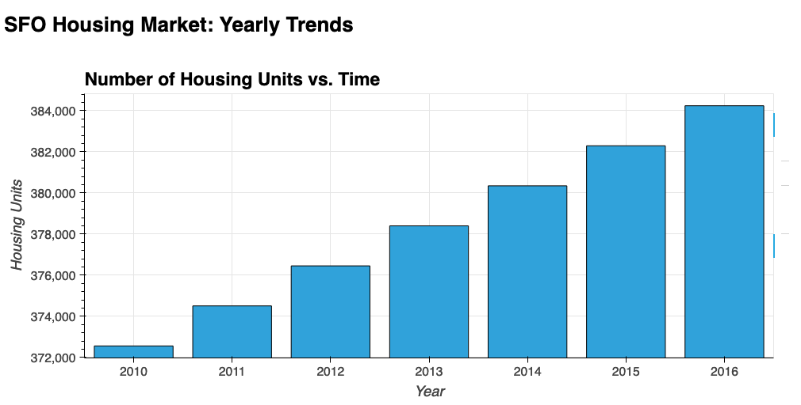</img>

---

### Average Housing Costs in San Francisco Per Year

In this section, we determine the average sales price by year and the average gross rent by year to better understand how housing prices are evolving over time.  For example, we may want to know if property values are increasing or decreasing so that we can buy or sell a property at an opportune time, or how rent prices are changing so we can know how much money to expect from rental income in the future.

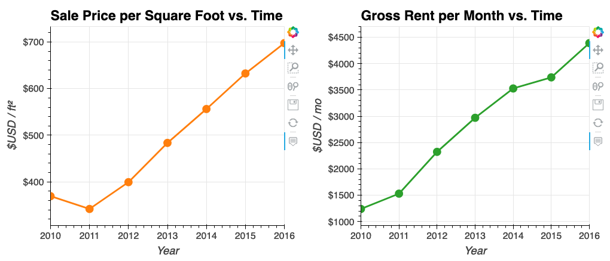</img>

The plot below is called a "violin plot."  Violin plots allow you visualize not only the trend but also the distribution of values about the trend.  Here, we plot average sale price square foot as an example.

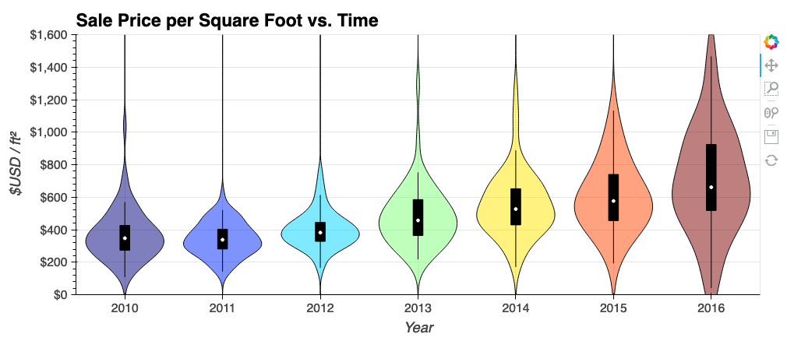</img>

---

### Housing-Market Data By Neighborhood

The plots in the previous section are for the average of all SFO neighborhoods, but what if we'd a more precise view of the sale price per square foot or gross rent per month on a per-neightborhood basis?  These quantities are plotted below in a type of plot that is sometimes called a "crossfilter" plot.  Crossfilter plots are similar to scatter plots, however, the size of the bubbles and color of the bubbles are used to represent third and fourth dimensions of the data (in addition to the usual 2D {x,y}-coordinates).  In the plot below, the size/color of the bubbles are proportional to the gross rent per month (numerator) divided by the sale price per square foot (denominator).  The numerator is a proxy for the monthly income generated from renting the property out, whereas the numerator is a proxy for the cost to purchase the property.  Thus, the (numerator / denominator) is an approximate figure of merit that may guide real estate investors as to which properties offer more "bang for their buck."  The big green dot near the upper-left corner of the plot represents a cheap-but-lucrative investment.

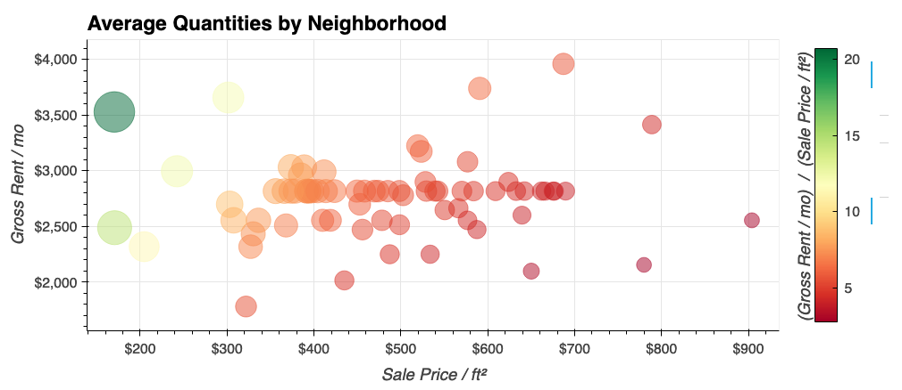</img>

In the dashboard version of the plot below, you can choose a neighborhood from the drop-down menu at the upper left in order to see how relevant quantities are changing over time for that particular neighborhood.

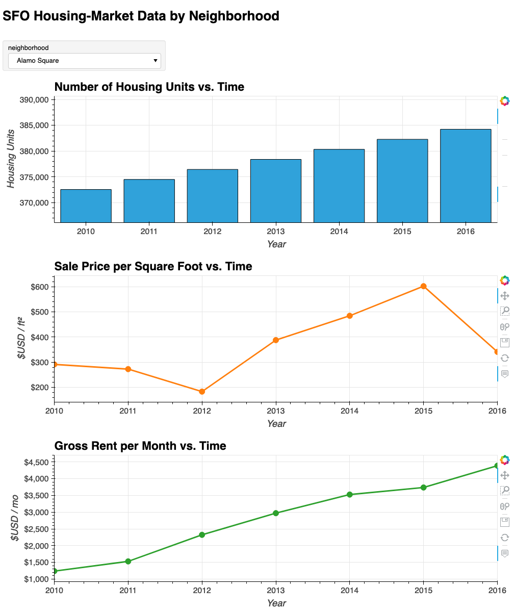</img>

### Top 10 Most Expensive Neighborhoods

In this section, we target expensive (lucrative?) neighborhoods in San Francisco.  The plot below shows the top 10 most expensive neighborhoods as measured by average sale price per square foot.  Note, the zero of the vertical axis is suppressed: Although the least-expensive neighborhoods (right of plot) appear to be much less expensive than the most-expensive neighborhoods (left of plot), the least-expensive neighborhoods are still among the top 10 most expensive neighborhoods in the entire set of SFO neighborhoods!

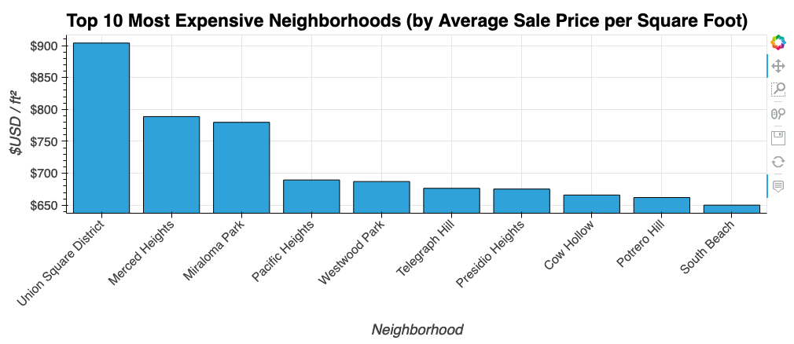</img>

Armed with the knowledge of which neighborhoods are the most expensive (see plot above) the interactive plot below let's you choose an expensive neighborhood by name and explore the average costs of that neighborhood by year.

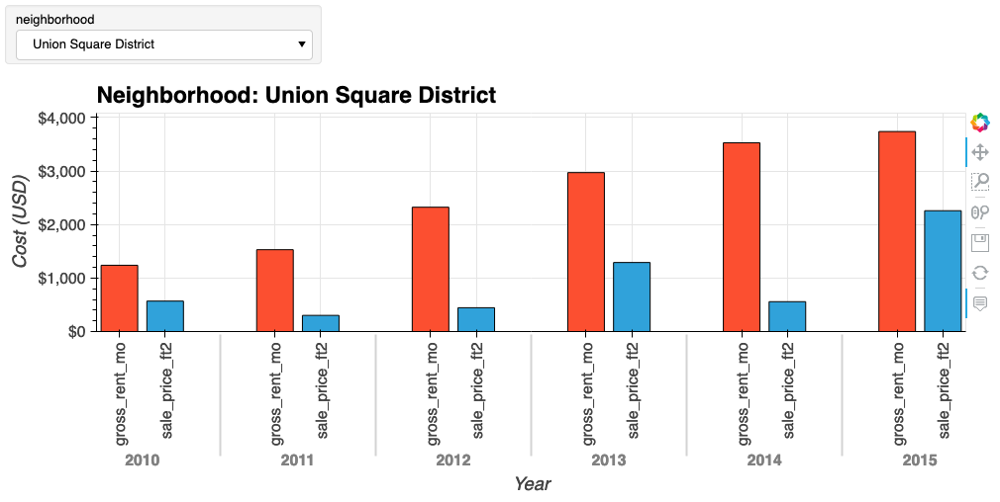</img>

---

### Neighborhood Map

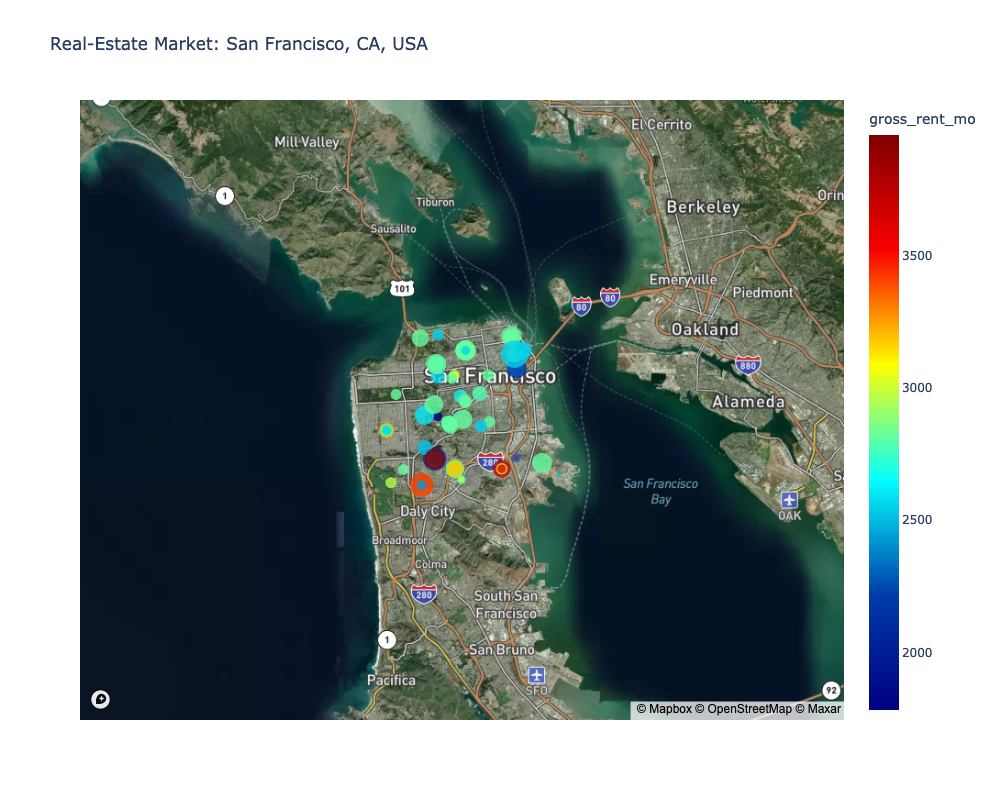</img>

---

### Parallel-Coordinates Plot

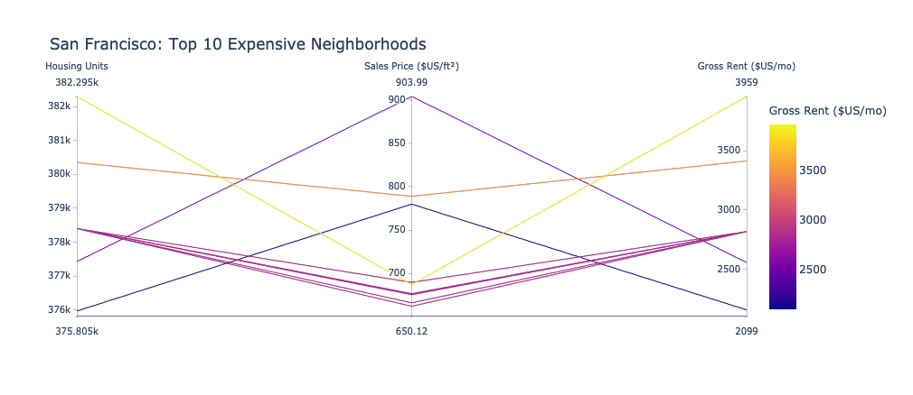</img>

### Parallel-Categories Plot

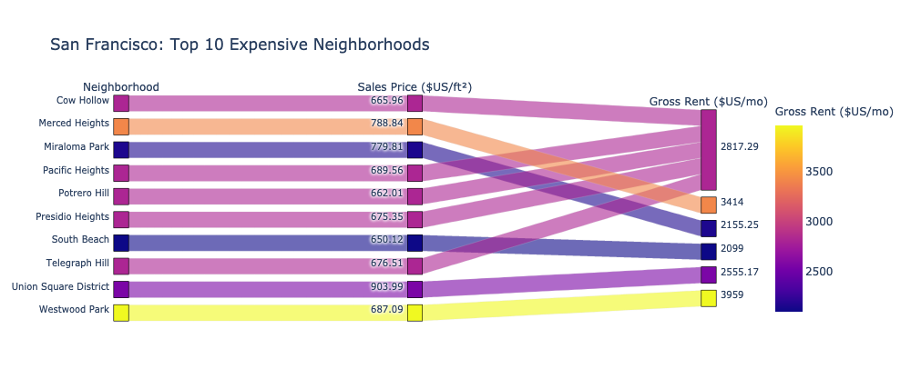</img>

### Sunburst Plot

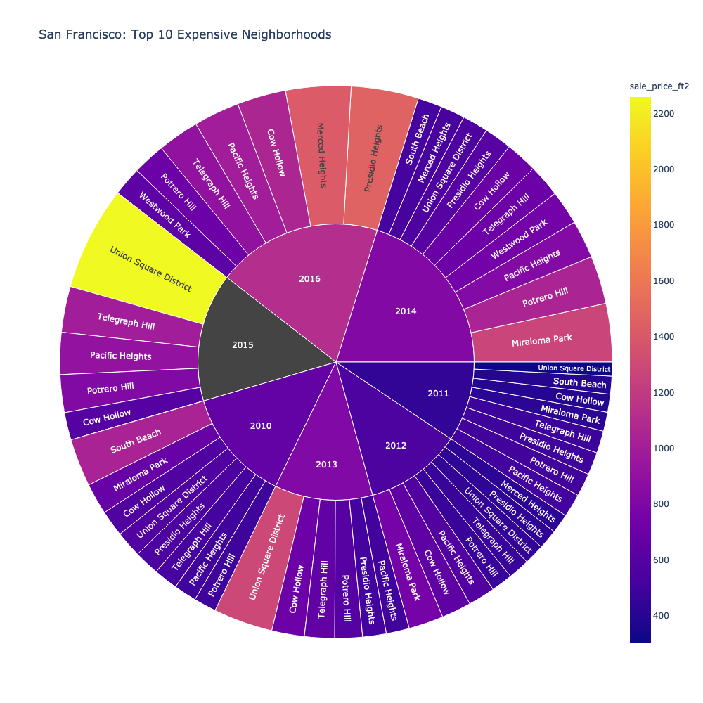</img>

---

## References

### Python Visualization

- [HoloViz](https://holoviz.org/)
  - [Panel](https://panel.holoviz.org/): A high-level app and dashboarding solution for Python
  - [hvPlot](https://hvplot.holoviz.org/): A high-level plotting API for the PyData ecosystem built on HoloViews
  - [HoloViews](https://holoviews.org/): Stop plotting your data - annotate your data and let it visualize itself

### Python Installation

<!--
The installation instructions shown below were verified to work on MacOS 10.15 ("Catalina"), Windows 10, and Ubuntu 20.04 using [Anaconda](https://anaconda.org/) as a Python package manager.  After you install the required Python packages, you should be able to launch a Jupyter Lab/Notebook and run `timeseries-analysis.ipynb` and `regression-analysis.ipynb` yourself -- have fun! :thumbsup: :smile:
--->


```bash
# Example installation of Python packages with Anaconda
(base) $  conda update conda  # make sure you're up to date
(base) $  conda update --all  # double-check to be sure!
(base) $  conda create --name housing-market-analysis python=3.7 anaconda  # create new environment
(base) $  conda activate housing-market-analysis  # activate the newly created environment
(housing-market-analysis) $  conda install -c conda-forge hvplot plotly python-dotenv  # most of what we need
(housing-market-analysis) $  conda install selenium  # export images with `bokeh`
(housing-market-analysis) $  conda install -c conda-forge firefox geckodriver  # Firefox users
```

### Typical Python Imports for Dashboarding

```python
# Typical imports for dashboarding with Python
import numpy as np
import pandas as pd
import panel as pn
import plotly.express as px
pn.extension('plotly')  # this needs to come before `import hvplot.xyz`s (see below)
import hvplot.pandas  # can also do `pd.options.plotting.backend = 'holoviews'`
```

---
