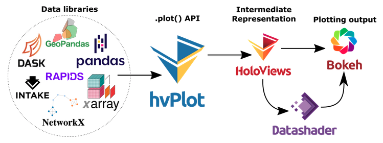

# Housing Market Analysis

</img>
*Image Credit (Above): [San Francisco Park Reading by Juan Salamanca](https://www.pexels.com/photo/park-san-francisco-reading-61109/) | [Free License](https://www.pexels.com/photo-license/)*

</img>

---

## Quick Start

### How to Launch the Dashboard Application

```bash
# Run the web-based dashboard app from the command line (Linux/Unix)
(housing-market-analysis) $  cd <path-to-this-repository>
(housing-market-analysis) $  bash ./run.sh
2021-08-27 16:19:02,990 Starting Bokeh server version 2.3.3 (running on Tornado 6.1)
2021-08-27 16:19:02,992 User authentication hooks NOT provided (default user enabled)
2021-08-27 16:19:02,995 Bokeh app running at: http://localhost:5006/housing-market-dashboard
2021-08-27 16:19:02,995 Starting Bokeh server with process id: 59499

# Now copy the link from the output above and paste it into your web browser, e.g.
http://localhost:5006/housing-market-dashboard
```

If you have trouble seeing the interactive MapBox plot in the web-based dashboard application, try opening and running the file [housing-market-dashboard.ipynb](./housing-market-dashboard.ipynb) in Jupyter Lab.  The dashboard application will be near the bottom of the notebook along, with some instructions for troubleshooting.  In order to successfully run the dashboard application, the environment variable `MAPBOX_API_KEY` must be set.  The code automatically uses Python's `dotenv` to load the default file named `./.env` where the user's `MAPBOX_API_KEY` variable should be defined.

---

## Table of Contents

- [Introduction](#introduction)
- [Technologies Utilized](#technologies-utilized)
- [Important Files](#important-files)
- [Housing-Market Analysis Details](#housing-market-analysis-details)
  - [Housing Units Per Year](#housing-units-per-year)
  - [Average Housing Costs in San Francisco by Year](#average-housing-costs-in-san-francisco-by-year)
  - [Housing-Market Data By Neighborhood](#housing-market-data-by-neighborhood)
  - [Top 10 Most Expensive Neighborhoods](#top-10-most-expensive-neighborhoods)
  - [Neighborhood Map](#neighborhood-map)
  - [Parallel Plots](#parallel-plots)
  - [Sunburst Plot](#sunburst-plot)
- [Notes and References](#notes-and-references)
  - [Python Visualization](#python-visualization)
  - [Python Installation](#python-installation)
  - [Typical Python Imports for Dashboarding](#typical-python-imports-for-dashboarding)
- [Quick Start](#quick-start)
  - [Dashboard](#dashboard)

---

## Introduction

In this GitHub repository, we explore the real estate market in San Francisco, CA, USA, by providing interactive charts, maps, and other visualizations in the form of a dashboard application that may help investors make educated decisions about potential investment opportunities.  The analysis calculations are worked out in the analysis notebook [housing-market-analysis.ipynb](./housing-market-analysis.ipynb), and the dashboard application is created in the file [housing-market-dashboard.ipynb](./housing-market-dashboard.ipynb).  An animated GIF of the working dashboard application is shown above.

## Tools and Technologies

- [Python](https://www.python.org/)
- [Numpy](https://numpy.org/)
- [Pandas](https://pandas.pydata.org/)
- [hvPlot](https://hvplot.holoviz.org/)
- [Plotly](https://plotly.com/)
- [MapBox](https://www.mapbox.com/) (API token required)
- [Panel](https://panel.holoviz.org/)

</img>

## Important Files

- [housing-market-analysis.ipynb](housing-market-analysis.ipynb): Analysis notebook upon which the dashboard app is built
- [housing-market-dashboard.ipynb](housing-market-dashboard.ipynb): Interactive dashboard application
- [sfo_neighborhood_coordinates.csv](./data/sfo_neighborhood_coordinates.csv): Latitudes and longitudes of San Francisco neighborhoods
- [sfo_neighborhoods_census_data.csv](./data/sfo_neighborhoods_census_data.csv): Housing data of San Francisco neighborhoods

## Analysis Details

### Housing Units Per Year

In this section, we calculate the average number of housing units per year across San Francisco (SFO) neighborhoods and visualize the results as a bar chart using Pandas, hvPlot, and Bokeh as a backend.

</img>

---

### Average Housing Costs in San Francisco by Year

In this section, we determine the average sales price by year and the average gross rent by year to better understand how housing prices are evolving over time.  For example, we may want to know if property values are increasing or decreasing so that we can buy or sell a property at an opportune time, or how rent prices are changing so we can know how much money to expect from rental income in the future.

</img>

The plot below is called a "violin plot."  Violin plots allow you visualize not only the trend but also the distribution of values about the trend.  Here, we plot average sale price square foot as an example.

</img>

---

### Housing-Market Data By Neighborhood

The plots in the previous section are the average data for all SFO neighborhoods.  What if we'd like to plot the data by neighborhood instead?  The "crossfilter" plot shown below is similar to a scatter plot, however, the size and color of the bubbles are used to represent third and fourth dimensions of the data (in addition to the usual 2D {x,y}-coordinates).  In the plot below, the size and color of the bubbles are proportional to the gross rent per month (numerator) divided by the sale price per square foot (denominator).  The numerator is a proxy for the monthly income generated from renting the property out, whereas the numerator is a proxy for the cost to purchase the property.  Thus, the (numerator / denominator) is an approximate figure of merit that may guide real estate investors as to which properties offer more "bang for the buck."  The big green dot near the upper-left corner of the plot represents a cheap-to-purchase but lucrative-to-own (and rent out) investment.  In the dashboard version of the plot, the hoverdata of the dots show relevant information including the neighborhood name.

</img>

In the dashboard version of the plot below, you can choose a neighborhood from the drop-down menu at the upper left in order to see how relevant quantities are changing over time for that particular neighborhood.

</img>

### Top 10 Most Expensive Neighborhoods

In this section, we target expensive (lucrative-to-rent-out?) neighborhoods in San Francisco.  The plot below shows the top 10 most expensive neighborhoods as measured by average sale price per square foot.  Note, the zero of the vertical axis is suppressed, i.e. although the least-expensive neighborhoods (right of plot) appear to be much less expensive than the most-expensive neighborhoods (left of plot), the least-expensive neighborhoods are still among the top 10 most expensive neighborhoods in the entire set of SFO neighborhoods!

</img>

Armed with the knowledge of which neighborhoods are the most expensive (see plot above), the interactive plot below let's you choose an expensive neighborhood by name and explore the average costs of that neighborhood by year.

</img>

---

### Neighborhood Map

A screenshot of the interactive dashboard map is shown below.

</img>

---

### Parallel Plots

Parallel plots allow us another way to visualize higher dimensions.  Examples of parallel-coordinate and parallel-categories plots are shown below.

#### Parallel-Coordinates Plot

</img>

#### Parallel-Categories Plot

</img>

### Sunburst Plot

From Plotly's [documentation](https://plotly.com/python/sunburst-charts/), "Sunburst plots visualize hierarchical data spanning outwards radially from root to leaves....  The root starts from the center and children are added to the outer rings."

</img>

---

## Notes and References

### Python Installation Details

```bash
# Create an isolated Python environment using the provided `requirements.yml` file
(base) $  conda env create -f requirements.yml
(base) $  conda activate housing-market-analysis
(housing-market-analysis) $  jupyter-lab  # open `housing-market-dashboard.ipynb`, etc.

# Example installation of Python packages with Anaconda
(base) $  conda update conda  # make sure you're up to date
(base) $  conda update --all  # double-check to be sure!
(base) $  conda create --name housing-market-analysis python=3.7 anaconda  # create new environment
(base) $  conda activate housing-market-analysis  # activate the newly created environment
(housing-market-analysis) $  conda install -c conda-forge hvplot plotly python-dotenv  # most of what we need
(housing-market-analysis) $  conda install selenium  # export images with `bokeh`
(housing-market-analysis) $  conda install -c conda-forge firefox geckodriver  # Firefox users
(housing-market-analysis) $  jupyter-lab  # open `housing-market-dashboard.ipynb`, for example
```

### Typical Python Imports for Dashboarding

```python
# Typical imports for dashboarding with Python
import numpy as np
import pandas as pd
import panel as pn
import plotly.express as px
pn.extension('plotly')  # this needs to come before `import hvplot.pandas` (see below)
import hvplot.pandas  # can also do `pd.options.plotting.backend = 'holoviews'`
```

---
